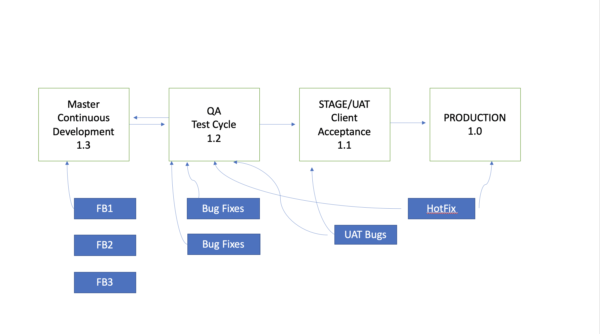

# Git Workflow <PROJECT NAME>

The repository uses Feature Branch workflow as defined here in this [link](https://www.atlassian.com/git/tutorials/comparing-workflows/feature-branch-workflow)

Primarily each Repository will have these 4 branches - 

1. Master - The purpose is to support active development
2. QA - Contains the features moved into testing, can be used for Bug Fixes
3. Stage/UAT - Contains the features, waiting for a sign-off from client before the release happens
4. Production - Current stable release on production

**All branches should be named in lower case**

## How it works

1. For new development, a branch will be taken out of **Master** branch, and will be named feature/<JIRA_ID>. 
2. For a bug fix, based on priority it can be taken out of **Master** or **QA** or **Stage**
3. For a hot fix (an urgent request on production), it will be taken out of **Production**
4. Once the task is completed, a Pull Request will be raised against the branch it was created from.
5. An exception to above rule, if it is a Hotfix or a Bugfix on QA, the PR will be raised against primary branch (where it was created from) and the QA branch (for testing).
6. If there are PRs released to QA, Stage or Production branch in Exception cases, then these branches need to get in sync in reverse order. (Check the diagram below) 

## Here is a glimpse of the workflow - 
